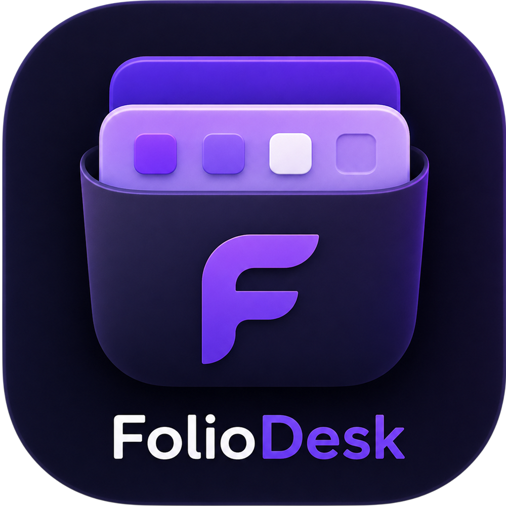

# FolioDesk

**Windows 바탕화면에 모바일 스타일 앱 폴더를**

[다운로드](#-다운로드) · [기능 소개](#-기능) · [사용법](#-사용법) · [기여하기](#-기여하기) · [English](README.en.md)

---

## 📖 소개

FolioDesk는 iOS / Android의 앱 폴더 경험을 Windows 바탕화면으로 가져옵니다.

바탕화면에 흩어진 아이콘들을 모바일처럼 폴더로 묶어 정리하고, 클릭 한 번으로 열고 닫을 수 있습니다.  
복잡한 설정 없이 설치 직후 바로 사용할 수 있으며, 백그라운드에서 상주하지 않아 시스템 리소스를 소모하지 않습니다.

## 🎬 시연 영상

## ✨ 기능

- **모바일 스타일 앱 폴더** — iOS / Android와 동일한 방식으로 앱을 폴더로 묶어 정리
- **바탕화면 단축키** — 폴더 단축키를 더블클릭하면 커서 위치에 팝업으로 열림
- **드래그앤드롭으로 앱 추가** — 실행 파일(.exe)을 폴더 단축키 위로 끌어다 놓으면 자동 등록
- **폴더 내 순서 변경** — 아이콘을 끌어다 놓아 순서를 자유롭게 바꾸기
- **폴더에서 꺼내기** — 아이콘을 폴더 밖으로 드래그하면 바탕화면으로 복원
- **자동 아이콘 추출** — 등록된 앱의 아이콘을 자동으로 추출해 폴더 썸네일 생성
- **다국어 지원** — 한국어 / 영어 / 중국어 / 일본어 (버튼 한 번으로 전환)
- **가벼운 실행** — 백그라운드 상주 없음. 폴더를 열 때만 실행되고 닫으면 종료

## 💾 다운로드

| 플랫폼 | 다운로드 |
|--------|---------|
| Windows 10 / 11 (64-bit) | [**최신 버전 받기 →**](https://github.com/doka1203/FolioDesk/releases/latest) |

> 관리자 권한 없이 설치 가능합니다. 설치 경로는 `%LocalAppData%\FolioDesk` 입니다.

## 🚀 시작하기

1. [최신 릴리즈](https://github.com/doka1203/FolioDesk/releases/latest)에서 `FolioDesk_Setup.exe`를 다운로드합니다.
2. 설치 파일을 실행합니다. (관리자 권한 불필요)
3. 설치 완료 후 FolioDesk가 자동으로 실행됩니다.

## 📋 사용법

### 폴더 만들기

1. FolioDesk 메인 창을 열고 **폴더 만들기** 버튼을 클릭합니다.
2. 바탕화면에 폴더 단축키가 생성됩니다.

### 앱 추가하기

- 바탕화면의 `.exe` 파일(또는 다른 단축키)을 폴더 단축키 위로 **드래그앤드롭** 합니다.
- 앱 아이콘이 자동으로 추출되어 폴더에 등록됩니다.

### 폴더 열기

- 폴더 단축키를 **더블클릭**하면 커서 위치에 폴더 팝업이 열립니다.
- 앱 아이콘을 클릭하면 해당 앱이 실행되고 폴더가 닫힙니다.
- 폴더 바깥 영역을 클릭하면 폴더가 닫힙니다.

### 앱 꺼내기 / 순서 변경

- 폴더 내 아이콘을 **폴더 바깥으로 드래그**하면 바탕화면으로 복원됩니다.
- 폴더 내 아이콘을 **다른 아이콘 위로 드래그**하면 순서가 바뀝니다.

### 언어 변경

- 메인 창의 언어 토글 버튼을 클릭하면 한국어 → 영어 → 중국어 → 일본어 순으로 전환됩니다.

## 🛠 기술 스택

| 항목 | 내용 |
|------|------|
| 언어 | C# |
| 프레임워크 | .NET 10, WPF |
| 데이터 저장 | JSON (`%LocalAppData%\FolioDesk\folio.json`) |
| 인스톨러 | Inno Setup |
| 아이콘 추출 | Win32 API (Shell32, ExtractIconEx) |

## 🤝 기여하기

버그 리포트, 기능 제안, PR 모두 환영합니다!

1. 이 저장소를 Fork 합니다.
2. 새 브랜치를 생성합니다 (`git checkout -b feature/amazing-feature`)
3. 변경 사항을 커밋합니다 (`git commit -m 'Add amazing feature'`)
4. 브랜치에 Push 합니다 (`git push origin feature/amazing-feature`)
5. Pull Request를 열어주세요.

버그나 제안은 [Issues](https://github.com/doka1203/FolioDesk/issues)에 남겨주세요.

## 📄 라이선스
## 📄 License

This project is licensed under the GNU General Public License v3.0 - see the [LICENSE](LICENSE) file for details.

Copyright (c) 2026 doka1203