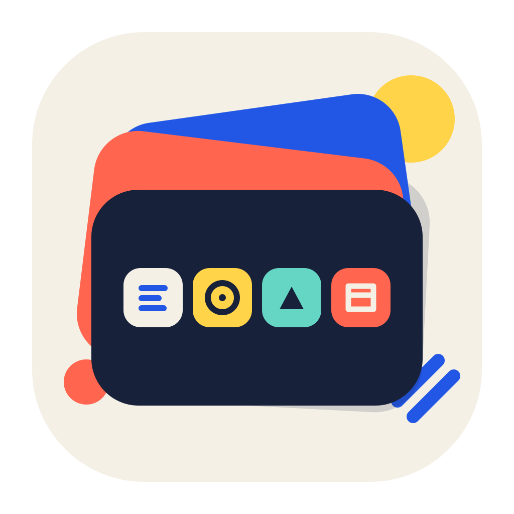

FolioDesk

A lightweight Windows app for a tidier desktop.

[Download](#Download) · [Usage](#Usage) · [Korean](README.ko.md)

## Overview

FolioDesk is a lightweight Windows app that organizes your desktop shortcuts into folders, much like app folders on a smartphone.
Each folder appears as a shortcut on your desktop. Drag apps or shortcuts onto it to add them, then open the folder in a compact pop-up at your cursor. You can launch, rearrange, customize, or move items back to the desktop whenever you like.
FolioDesk runs only when needed—without a background process—and stores all data locally on your PC.

## Download

[Download the latest release](https://github.com/doka1203/FolioDesk/releases/latest) and choose the installer that matches your PC.

| System | Look for |
|---|---|
| Most Intel or AMD Windows PCs | `win-x64` |
| ARM-based Windows PCs | `win-arm64` |

FolioDesk supports Windows 10 and 11. The installer does not require administrator privileges, and official releases include the required .NET runtime.

## Usage

### 1. Create a folder

Open FolioDesk and click **New Folder**. A new FolioDesk folder shortcut will appear on your desktop.

### 2. Add apps

Drag an `.exe` or `.lnk` file onto the folder shortcut. FolioDesk will add the item and update the folder icon automatically.

Files added from the desktop are moved into FolioDesk's local storage. Files added from anywhere else are copied, so the originals stay where they are.

### 3. Open and organize

Double-click the folder shortcut to open it at your current cursor position.

- Click an icon to launch it.
- Drag an icon onto another icon to rearrange the items.
- Drag an icon out of the pop-up to move it back to the desktop.
- Use the settings button in the top-right corner to change the folder color.
- Click anywhere outside the pop-up to close it.

### 4. Change the language

Click the language button in the main window to cycle through Korean, English, Chinese, and Japanese. FolioDesk remembers your choice the next time it starts.

## Data storage

FolioDesk keeps its settings and folder contents in `%LocalAppData%\FolioDesk`.

| Path | Contents |
|---|---|
| `folio.json` | Folder and item data |
| `icons\<folder ID>` | Stored files and generated icons |
| `language.cfg` | Language preference |
| `logs\FolioDesk.log` | Application and error logs |

Before uninstalling FolioDesk or deleting its data folder, move any files you want to keep back to the desktop or make a backup of the entire folder. Items added from the desktop may have their original files stored here.

## Contributing

If you run into a bug or have an idea for an improvement, feel free to [open an issue](https://github.com/doka1203/FolioDesk/issues). Pull requests are welcome too. For larger changes, please open an issue first so we can discuss the approach before you start.

There are no automated tests yet. After making changes, please check folder creation, adding and rearranging items, moving items back to the desktop, changing folder colors, and switching languages manually.

## License

FolioDesk is released under the [GNU General Public License v3.0](LICENSE).

Copyright (c) 2026 DOKA1203
