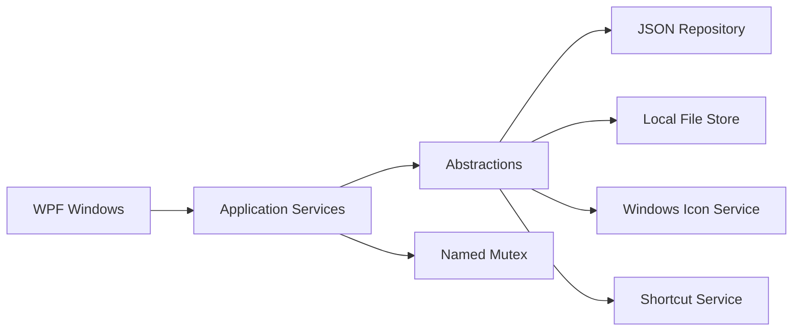

# FolioDesk 프로젝트 가이드

이 문서는 FolioDesk의 코드 구조, 실행 방식, 데이터 흐름과 개발·배포 절차를 설명한다. 프로그램 설치 및 사용 방법은 루트의 [`README.md`](../README.md)를 참고한다.

## 1. 프로젝트 개요

FolioDesk는 Windows 바탕화면의 실행 파일과 바로 가기를 모바일 앱 폴더처럼 묶어 주는 WPF 애플리케이션이다. 폴더마다 바탕화면 바로 가기(`.lnk`)가 생성되며, 이를 실행하면 현재 마우스 커서 위치에 폴더 팝업이 열린다.

주요 특성은 다음과 같다.

- C#, .NET 10, WPF 기반의 Windows 전용 애플리케이션
- 백그라운드 상주 프로세스 없이 명령행 인수로 실행 모드 분기
- JSON 파일 기반 로컬 저장
- Win32 API와 Windows Script Host COM을 이용한 아이콘·바로 가기 처리
- 한국어, 영어, 중국어, 일본어 런타임 전환
- x64 및 ARM64용 self-contained 배포

## 2. 저장소 구조

```text
FolioDesk/
├─ .github/workflows/main.yml       태그 기반 빌드·릴리스 자동화
├─ FolioDesk/
│  ├─ Application/                  유스케이스와 작업 조정
│  │  └─ Abstractions/              저장소·파일·아이콘·바로 가기 인터페이스
│  ├─ Icons/                        아이콘 추출 및 폴더 아이콘 생성
│  ├─ Infrastructure/               JSON, 파일 시스템, 프로세스 간 잠금 구현
│  ├─ Models/                       저장되는 데이터 모델
│  ├─ Resources/Strings/            언어별 WPF 리소스 사전
│  ├─ Services/                     다국어 및 로그 서비스
│  ├─ ShortCuts/                    Windows 바로 가기 구현
│  ├─ App.xaml.cs                   시작점과 실행 모드 라우팅
│  ├─ AppComposition.cs             의존성 수동 조립
│  ├─ MainWindow.*                  폴더 생성 관리자 창
│  ├─ FolioFolderWindow.*           앱 폴더 팝업
│  └─ IconSettingsWindow.*          폴더 색상 설정 창
├─ Installer/FolioDesk.iss          Inno Setup 설치 스크립트
├─ README.md                        한국어 사용자 안내
└─ README.en.md                     영어 사용자 안내
```

## 3. 실행 모드

`App.OnStartup`은 명령행 인수 개수에 따라 서로 다른 작업을 수행한다.

| 명령 | 동작 | 종료 시점 |
|---|---|---|
| `FolioDesk.exe` | `MainWindow`를 열어 폴더를 생성 | 사용자가 창을 닫을 때 |
| `FolioDesk.exe <folderId>` | 커서 위치에 해당 폴더 팝업 표시 | 팝업이 닫힐 때 |
| `FolioDesk.exe <folderId> <path>` | 파일을 폴더에 추가 | 작업 직후 |

폴더 생성 시 만들어지는 바탕화면 바로 가기는 첫 번째 인수로 폴더 ID를 전달한다. Windows가 파일을 이 바로 가기 위에 드롭하면 두 번째 인수로 원본 경로가 전달되어 항목 추가 모드로 실행된다.

지원하지 않는 인수 개수나 0 이하의 폴더 ID는 오류로 처리하고 로그와 메시지 상자에 기록한다.

## 4. 아키텍처

코드는 완전한 MVVM보다 UI 코드와 애플리케이션 작업의 선택적 분리를 사용한다.



### UI 계층

- `MainWindow`: 언어 변경, 업데이트 페이지 열기, 새 폴더 생성
- `FolioFolderWindow`: 항목 실행, 내부 순서 변경, 바탕화면으로 꺼내기, 설정 창 열기
- `IconSettingsWindow`: HSV/HEX/불투명도 기반 폴더 색상 변경
- 마우스 좌표, 드래그 고스트, 애니메이션, 창 포커스와 같은 표현 로직은 code-behind에 둔다.

### Application 계층

| 서비스 | 책임 |
|---|---|
| `CreateFolderService` | 폴더 데이터, 기본 아이콘, 바탕화면 바로 가기를 한 작업으로 생성 |
| `AddItemService` | 원본 저장, 아이콘 추출, JSON 등록, 합성 폴더 아이콘 갱신 |
| `FolderQueryService` | 최신 폴더 상태 조회 |
| `FolderContentService` | 항목 꺼내기와 순서 변경 |
| `FolderAppearanceService` | 폴더 색상 저장과 아이콘 갱신 |
| `FolderIconCoordinator` | 아이콘 생성, 바로 가기 갱신, 이전 아이콘 정리 |

여러 자원을 변경하는 서비스는 중간 실패 시 가능한 범위에서 이전 상태로 되돌리는 보상 작업을 수행한다.

### Infrastructure 및 플랫폼 계층

- `JsonFolioRepository`: 매 작업마다 최신 JSON을 읽고, 임시 파일과 `File.Replace`를 사용해 저장한다.
- `LocalItemFileStore`: 항목 파일을 앱 데이터 폴더로 이동 또는 복사하고, 꺼낼 때 바탕화면으로 이동한다.
- `NamedMutexFolioMutationLock`: 여러 FolioDesk 프로세스의 동시 수정을 직렬화한다.
- `WindowsShortcutService`: `WScript.Shell` COM으로 `.lnk`를 만들거나 아이콘을 변경한다.
- `IconExtractor`: 실행 파일, DLL, 바로 가기, 인터넷 바로 가기와 UWP 앱에서 아이콘을 찾는다.
- `IconGenerator`: 최대 4개 항목 아이콘을 256×256 둥근 배경 위에 합성해 `.ico`로 저장한다.

### 의존성 구성

`AppComposition`이 인터페이스와 Windows 구현체를 수동으로 연결한다. 별도 DI 컨테이너는 사용하지 않는다. 생성자는 디스크 읽기나 COM 생성을 수행하지 않으며, 실제 작업이 호출될 때만 외부 자원에 접근한다.

## 5. 핵심 데이터 흐름

### 폴더 생성

```text
MainWindow
  → CreateFolderService
  → folio.json에 폴더 추가
  → 빈 폴더 아이콘 생성
  → 바탕화면 .lnk 생성
  → 사용하지 않는 이전 아이콘 정리
```

아이콘 또는 바로 가기 생성에 실패하면 JSON의 폴더 레코드와 해당 폴더 저장소를 정리한다.

### 항목 추가

```text
바탕화면 바로 가기로 파일 드롭
  → FolioDesk.exe <folderId> <path>
  → 앱 저장소로 원본 이동 또는 복사
  → icon.png 추출
  → folio.json에 항목 추가
  → 합성 폴더 아이콘 및 .lnk 갱신
```

바탕화면에 있던 파일은 앱 저장소로 이동하고, 그 밖의 위치에 있던 파일은 복사한다. 같은 이름이 이미 있으면 `이름 (2)`, `이름 (3)` 형식으로 고유 이름을 만든다.

### 항목 꺼내기와 순서 변경

- 항목을 팝업 밖으로 드래그하면 원본 파일을 바탕화면으로 이동하고 JSON에서 제거한다.
- 같은 파일명이 바탕화면에 이미 있으면 `(2)`부터 번호를 붙인다.
- 항목을 다른 항목 위에 드롭하면 목록 순서를 저장하고 합성 폴더 아이콘을 다시 만든다.
- 저장이나 아이콘 갱신이 실패하면 원래 파일 위치 또는 순서 복원을 시도한다.

## 6. 로컬 데이터

기본 데이터 루트는 `%LocalAppData%\FolioDesk`이다.

```text
%LocalAppData%\FolioDesk\
├─ folio.json                       현재 폴더/항목 데이터
├─ folio.json.bak                   직전 정상 데이터 백업
├─ language.cfg                     선택 언어(ko, en, zh, ja)
├─ logs\
│  ├─ FolioDesk.log                 현재 로그(최대 약 512 KiB)
│  └─ FolioDesk.log.old             회전된 이전 로그
├─ icons\<folderId>\
│  ├─ <generated-guid>.ico          합성 폴더 아이콘
│  └─ <itemName>\
│     ├─ <original-file>            보관된 실행 파일 또는 바로 가기
│     └─ icon.png                   추출된 항목 아이콘
└─ recovery\orphaned-items\...      추적되지 않은 기존 파일 복구 영역
```

`folio.json`의 개념적 형태는 다음과 같다.

```json
{
  "Folders": [
    {
      "id": 1,
      "name": "새 폴더",
      "files": [
        {
          "name": "Example",
          "icon": "C:\\...\\icon.png",
          "path": "C:\\...\\Example.lnk",
          "order": 0
        }
      ],
      "iconColor": "#FFD8D8D8"
    }
  ]
}
```

저장소는 메모리에 장기 캐시하지 않고 매 호출마다 파일을 읽는다. 수정 작업 전체에는 `Local\FolioDesk.FolioData.Mutation` 이름의 뮤텍스를 사용하여 서로 다른 실행 모드 프로세스가 오래된 상태를 덮어쓰지 않게 한다. 주 데이터가 손상되면 백업 파일을 읽고 복원을 시도한다.

## 7. 아이콘 처리

아이콘 추출은 입력 형식에 따라 여러 경로를 사용한다.

- `.exe` / `.dll` / 일반 파일: Windows Shell 이미지 목록에서 JUMBO → EXTRALARGE → LARGE 순으로 시도
- `.lnk`: 대상 경로와 `IconLocation`을 해석한 뒤 재귀적으로 추출
- `.url`: 인터넷 바로 가기의 아이콘 위치 확인
- UWP/Store 앱: 바로 가기와 패키지 레지스트리, `AppxManifest.xml`, scale 변형 이미지를 탐색
- 최종 대체 경로: 연결 아이콘 또는 파일 자체의 아이콘/비트맵 로드

폴더 아이콘은 최대 4개의 `icon.png`를 사용한다. 새 아이콘은 GUID 파일명으로 먼저 만든 뒤 바탕화면 바로 가기에 적용하고, 적용이 끝난 후 이전 `.ico`를 삭제한다.

## 8. 개발 환경과 명령

### 요구 사항

- Windows 10 또는 11
- .NET 10 SDK
- 설치 파일을 로컬에서 만들 경우 Inno Setup 6

### 빌드와 실행

저장소 루트에서 실행한다.

```powershell
dotnet restore FolioDesk/FolioDesk.csproj
dotnet build FolioDesk/FolioDesk.csproj -c Release
dotnet run --project FolioDesk/FolioDesk.csproj
```

실행 모드를 직접 확인하려면 다음 명령을 사용할 수 있다. `<folderId>`는 기존 `folio.json`에 존재해야 한다.

```powershell
dotnet run --project FolioDesk/FolioDesk.csproj -- <folderId>
dotnet run --project FolioDesk/FolioDesk.csproj -- <folderId> "C:\path\to\app.lnk"
```

### 게시

프레임워크 종속 단일 대상 게시 예시:

```powershell
dotnet publish FolioDesk/FolioDesk.csproj -c Release -r win-x64 --self-contained false
```

GitHub Actions의 정식 릴리스는 x64와 ARM64를 각각 self-contained 단일 파일로 게시한 뒤 Inno Setup 설치 파일을 만든다.

## 9. 릴리스 절차

`.github/workflows/main.yml`은 `v*` 태그가 push될 때 다음 작업을 수행한다.

1. 태그, 수동 입력 또는 프로젝트 파일에서 버전을 결정한다.
2. `win-x64`, `win-arm64` 런타임을 병렬 행렬로 복원·게시한다.
3. `PublishSingleFile`과 native library self-extract 옵션으로 self-contained 결과를 만든다.
4. Inno Setup으로 사용자 권한 설치 프로그램을 만든다.
5. 태그 실행이면 두 설치 파일을 GitHub Release에 업로드한다.

버전은 `FolioDesk/FolioDesk.csproj`의 `<Version>`과 릴리스 태그(`v2.0.1` 형식)를 일치시키는 것이 좋다.

## 10. 로깅과 문제 해결

로그는 `%LocalAppData%\FolioDesk\logs\FolioDesk.log`에 기록된다. 파일이 약 512 KiB를 넘으면 `.old`로 한 번 회전한다. 로깅 실패는 사용자 작업을 중단시키지 않는다.

문제 발생 시 다음 순서로 확인한다.

1. 로그에서 `ERROR` 또는 `WARN` 항목을 확인한다.
2. `folio.json`이 유효한지 확인하고, 필요하면 `folio.json.bak`과 비교한다.
3. 폴더 ID에 해당하는 바탕화면 바로 가기와 `icons\<folderId>` 저장소가 모두 존재하는지 확인한다.
4. 바로 가기 생성 오류라면 Windows Script Host 사용 가능 여부를 확인한다.
5. 아이콘 오류라면 원본 대상과 UWP 패키지가 여전히 설치되어 있는지 확인한다.

## 11. 변경 시 지켜야 할 경계

- JSON, 파일, 아이콘, 바로 가기를 함께 바꾸는 작업은 Application Service에서 조정한다.
- 모든 데이터 수정은 `IFolioMutationLock` 범위 안에서 수행한다.
- 저장소는 프로세스 수명 동안 데이터를 캐시하지 않는다.
- 외부 자원 변경 뒤 실패할 수 있는 작업에는 보상 또는 복구 경로를 둔다.
- 마우스 좌표와 애니메이션 같은 표현 전용 동작은 WPF code-behind에 유지한다.
- 새 플랫폼 기능은 Application의 추상화 뒤에 구현하여 유스케이스가 Win32 세부 사항에 직접 의존하지 않게 한다.
- 생성자에서 파일 I/O나 COM 초기화를 수행하지 않는다.

## 12. 현재 검증 범위와 제약

- 자동화된 테스트 프로젝트는 아직 없다.
- WPF, Win32 P/Invoke, COM에 의존하므로 Windows 외 운영체제에서는 실행할 수 없다.
- 폴더 삭제 UI는 현재 제공되지 않는다. 내부 서비스에는 생성 실패 롤백을 위한 삭제 기능만 있다.
- 앱 데이터 폴더를 수동 삭제하면 등록된 항목 원본과 아이콘도 함께 사라질 수 있으므로 백업 없이 삭제하지 않아야 한다.

변경 후에는 최소한 Release 빌드, 세 가지 실행 모드, 항목 추가·재정렬·꺼내기, 색상 변경, 네 언어 전환을 수동 확인한다.
